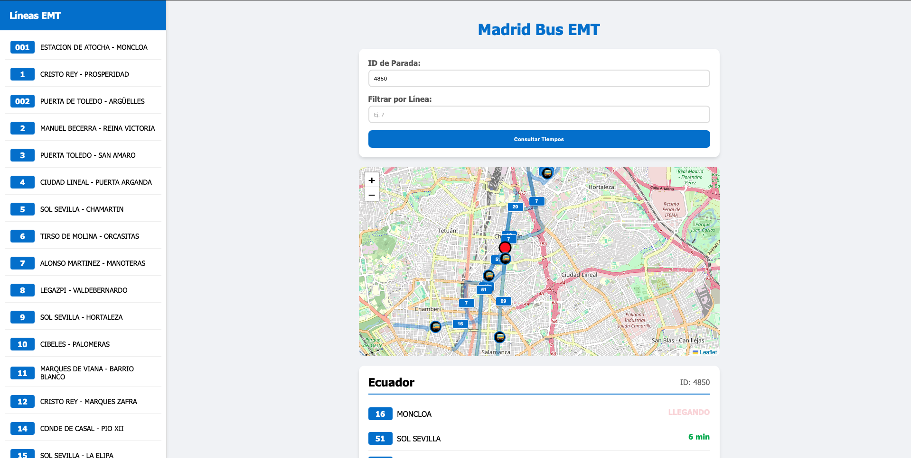

# Consulta de Tiempos de Llegada Autobuses EMT Madrid

  
  

Este es un proyecto en **Flask** que permite consultar los tiempos estimados de llegada de los autobuses de la **EMT Madrid** en una parada específica y para una línea determinada.

## 📸 Ejemplo de funcionamiento


## 📌 Características
- Consulta en tiempo real de tiempos de llegada de autobuses.
- **Localización de autobuses en tiempo real** sobre el mapa.
- Visualización de **todas las líneas** que pasan por una parada.
- Mapa interactivo con **sentido de la marcha** en las paradas.
- Integración con la API pública de **EMT Madrid** (MobilityLabs).

## 🛠️ Instalación
### 1️⃣ Clonar el repositorio
```bash
  git clone https://github.com/jdelafarauna/EMT-Madrid.git
  cd EMT-Madrid
```
### 2️⃣ Crear y activar un entorno virtual (opcional pero recomendado)
```bash
  python -m venv venv
  source venv/bin/activate  # En macOS y Linux
  venv\Scripts\activate     # En Windows
```
### 3️⃣ Instalar dependencias
```bash
  pip install -r requirements.txt
```
### 4️⃣ Configurar variables de entorno
Crear un archivo `.env` en la raíz del proyecto y agregar tus credenciales de **MobilityLabs**:
```
EMT_EMAIL=tu@email.com
EMT_PASSWORD=tu_password
X_CLIENT_ID=tu_client_id
X_API_KEY=tu_api_key
```

## 🚀 Uso
1️⃣ Ejecutar la aplicación:
```bash
  python app.py
```
2️⃣ Acceder a la interfaz web en el navegador:
```
  http://127.0.0.1:5001/
```
3️⃣ Ingresar el número de parada y la línea de autobús para consultar los tiempos de llegada.

## 🏗️ Estructura del Proyecto
```
/
├── templates/
│   ├── index.html
├── .env
├── app.py
├── requirements.txt
└── README.md
```

## 🤝 Contribución
¡Las contribuciones son bienvenidas! Para contribuir, sigue estos pasos:
1. Haz un **fork** del proyecto.
2. Crea una nueva **rama** (`feature-nueva-funcionalidad`).
3. Realiza tus cambios y haz un **commit** (`git commit -m "Añadida nueva funcionalidad"`).
4. Haz un **push** a tu rama (`git push origin feature-nueva-funcionalidad`).
5. Abre un **Pull Request**.

## 📄 Licencia
Este proyecto está bajo la licencia **MIT**.
